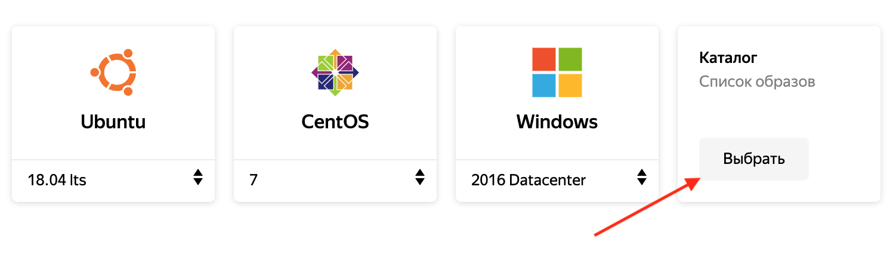

# Запуск Waves Node в Яндекс.Облаке

1. В [консоли](https://console.cloud.yandex.ru/) Яндекс.Облака перейдите в нужную группу ресурсов.

 <br>

2. В правом верхнем углу экрана нажмите **Создать ресурс**. Выберите **Виртуальная машина**.

 <br>

3. Зайдите в **Каталог образов**.

 <br>

4. Введите **Waves Node** в строке поиска. Выберите образ Waves Node.

 <br>

5. Задайте параметры виртуальной машины. Минимальные аппаратные требования для запуска узла смотрите на странице Требования к аппаратному обеспечению.

 <br>

6. [Сгенерируйте](https://cloud.yandex.ru/docs/compute/operations/vm-connect/ssh) пару **SSH-ключей**. Введите открытый ключ пары в поле SSH-ключ. Завершите создание виртуальной машины, нажав **Создать ВМ**.

 <br>

7. Убедитесь, что виртуальная машина запущена, [подключившись](https://cloud.yandex.ru/docs/compute/operations/vm-connect/ssh#vm-connect) к ней по SSH. IP-адрес машины скопируйте из панели управления Яндекс.Облака.

```
shh <имя_пользователя>@<ip_адрес_виртуальной-машины>
```

8. В браузере перейдите на страницу http://<ip-адрес-виртуальной-машины>:8080 для запуска докер-контейнера [Waves Node](https://github.com/wavesplatform/Waves).

 <br>

9. Задайте необходимые настройки. По окончанию нажмите **Run my node!** Запустится докер-контейнер Waves Node с параметрами, которые вы указали.

10. Убедитесь, что контейнер запущен, выполнив в консоли виртуальной машины команду [docker ps](https://docs.docker.com/engine/reference/commandline/ps/).

```
sudo docker ps
```
